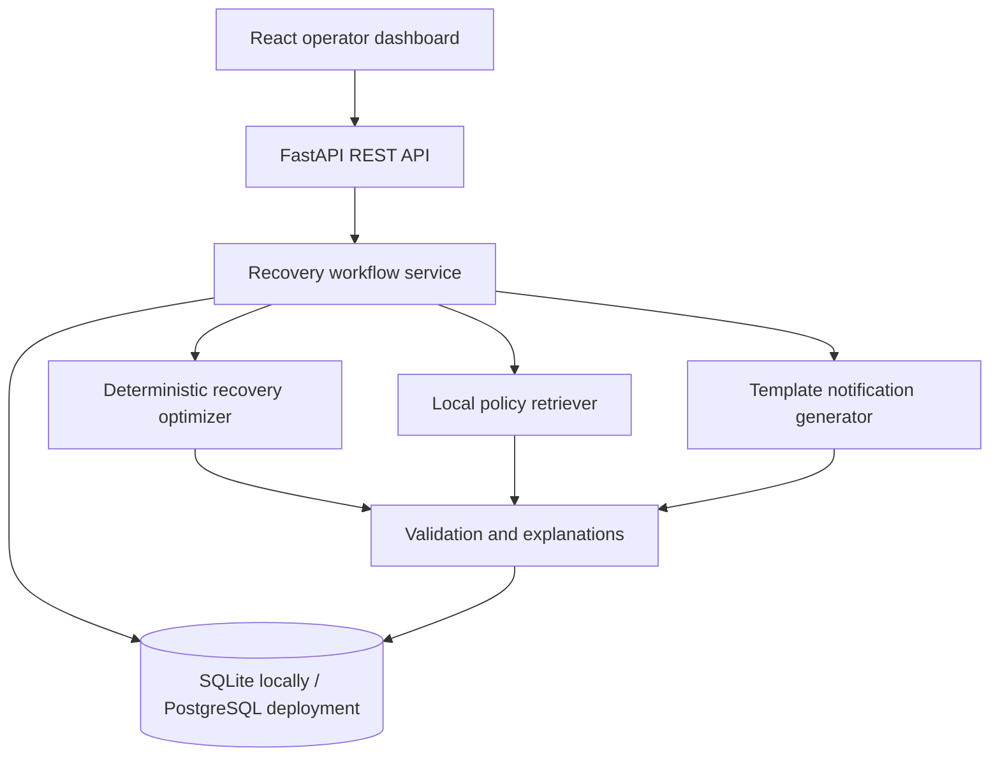
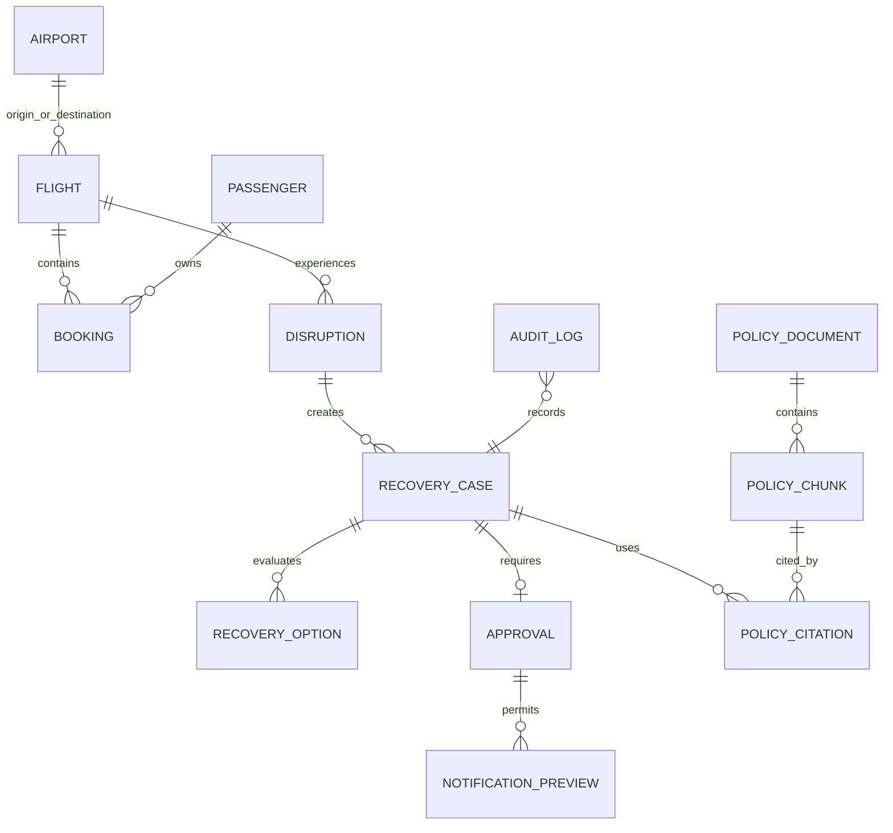

# AeroOps AI — Five-Day Execution Plan

## Product decision

The five-day deliverable is a functional, public portfolio demonstration—not a
claim of an airline-ready or real-time system. It uses a fictional airline,
six airports, twenty flights, fifty synthetic passengers and one simulated
cancellation.

## Reduced PRD

### Problem

When a flight is cancelled, an operator must identify affected passengers,
find feasible alternatives, apply operational and policy constraints, explain
the recommendation, obtain approval, and communicate consistently. The work
becomes difficult when capacity, cabins, passenger groups and accessibility
requirements interact.

### Primary user

An airline disruption-control operator using a fictional training environment.

### MVP user story

As an operator, I can open one simulated cancellation, see every affected
synthetic passenger, generate feasible direct alternatives within 24 hours,
understand why each option was recommended or rejected, inspect cited policy
evidence, approve a plan, preview notifications and review the audit trail.

### Functional requirements

1. Load exactly one deterministic synthetic demonstration scenario.
2. Detect confirmed passengers booked on the cancelled flight.
3. Find direct flights with the same origin and destination departing within
   24 hours.
4. Enforce remaining seat, cabin, group-integrity and accessibility constraints.
5. Rank feasible assignments using deterministic, documented scoring.
6. Explain every selected or rejected alternative with structured reason codes.
7. Retrieve relevant passages from five synthetic policy documents and show
   document title, section and passage citations.
8. Require explicit operator approval before creating notification previews.
9. Produce deterministic notification previews without a paid model API.
10. Audit scenario reset, recommendation generation, approval and notification
    creation.

### Non-functional requirements

- No real passenger data or confidential airline data.
- No actual bookings, payments, emails or messages.
- The same seed and inputs produce the same result.
- The core flow works without an LLM or external model API.
- API errors use clear status codes and messages.
- UI includes loading, error and empty states.
- Important business logic has automated tests.
- Secrets are supplied only through environment variables.

### Five-day success metrics

All values are **targets** until measured on Day 5.

- 100% constraint satisfaction in the seeded scenario.
- 100% of displayed policy evidence includes a valid document/section citation.
- 0 notification previews created before approval.
- 100% of consequential workflow transitions recorded in the audit log.
- Automated tests pass in GitHub Actions.
- Seed-to-approved-notification demo completes in under three minutes manually.

### Intentionally excluded

Live feeds, real-time claims, real passengers, GDS access, actual rebooking,
payments, refunds, email/SMS, crew or aircraft optimization, connecting
itineraries, interline recovery, Kubernetes, microservices, autonomous LLM
decisions and Emirates branding.

## Architecture



The LLM is not on the critical path. A later optional adapter may paraphrase an
already approved structured notification, but it cannot choose a recovery
flight or change workflow state.

## Final database schema



### Tables implemented on Day 1

- `airports`: airport code, name and city.
- `flights`: route, UTC schedule, status and remaining capacity by cabin.
- `passengers`: synthetic reference, display label, group and accessibility need.
- `bookings`: passenger-flight association, cabin and status.
- `disruptions`: affected flight, type, reason and creation time.
- `audit_logs`: actor, action, entity, JSON detail and timestamp.

### Tables added on Days 2–3

- `recovery_cases`: one case per affected passenger group.
- `recovery_options`: candidate flight, score, feasibility and reason codes.
- `approvals`: operator decision, comment and timestamp.
- `notification_previews`: deterministic content created after approval.
- `policy_documents` and `policy_chunks`: five synthetic policies and passages.
- `policy_citations`: links a recovery case to retrieved evidence.

## Repository structure

```text
aeroops-ai/
├── backend/
│   ├── app/
│   │   ├── routers/          # HTTP endpoints
│   │   ├── services/         # business logic
│   │   ├── config.py
│   │   ├── database.py
│   │   ├── main.py
│   │   ├── models.py
│   │   ├── schemas.py
│   │   └── seed.py
│   ├── tests/
│   └── requirements.txt
├── frontend/
│   ├── src/
│   │   ├── api.ts
│   │   ├── App.tsx
│   │   ├── main.tsx
│   │   ├── styles.css
│   │   └── types.ts
│   └── package.json
├── docs/
│   └── PROJECT_PLAN.md
├── .env.example
├── .gitignore
├── LICENSE
└── README.md
```

Day 2 will add optimizer modules; Day 3 will add policy documents and approval
modules. Empty future folders and placeholder implementations are deliberately
not included.

## Five-day hourly schedule

Each day has seven required focused hours plus one protected buffer hour. Stop
optional work whenever a required acceptance criterion is failing.

### Day 1 — Data-to-dashboard vertical slice

| Block | Work | Priority |
|---|---|---|
| Hour 1 | Verify WSL, Git, Python and Node; create repository and environments | Must |
| Hour 2 | Implement Day 1 tables and database session | Must |
| Hour 3 | Build deterministic 6-airport/20-flight/50-passenger seed | Must |
| Hour 4 | Implement scenario, disruption-impact and audit endpoints | Must |
| Hour 5 | Write and run API/seed/impact tests | Must |
| Hour 6 | Build React dashboard with loading/error/empty states | Must |
| Hour 7 | Run end-to-end, update README and capture first screenshot | Must |
| Hour 8 | Fix only blocking defects; otherwise stop and rest | Buffer |

Acceptance: exact dataset counts; twelve affected passengers; API tests pass;
dashboard visibly loads the cancelled flight and manifest; no real data appears.

### Day 2 — Deterministic recovery and explanations

| Block | Work | Priority |
|---|---|---|
| Hour 1 | Write recovery rules, score formula and test cases before coding | Must |
| Hour 2 | Query same-route direct alternatives within 24 hours | Must |
| Hour 3 | Enforce cabin, capacity, accessibility and group constraints | Must |
| Hour 4 | Implement deterministic assignment/ranking and rejection codes | Must |
| Hour 5 | Persist recovery cases/options and audit generation | Must |
| Hour 6 | Add recommendation and explanation panels to React | Must |
| Hour 7 | Run edge tests: insufficient seats, cabin mismatch and group split | Must |
| Hour 8 | Add a second scoring comparison only if all tests pass | If time remains |

Acceptance: every affected group is assigned or explicitly marked unassigned;
no constraint is violated; repeated runs return the same results; each result
has human-readable reasons and machine-readable reason codes.

### Day 3 — Policy evidence, approval and notification preview

| Block | Work | Priority |
|---|---|---|
| Hour 1 | Author five synthetic policy documents with section identifiers | Must |
| Hour 2 | Build local lexical retrieval and citation output | Must |
| Hour 3 | Create policy benchmark queries and retrieval tests | Must |
| Hour 4 | Implement recovery state machine and approval endpoint | Must |
| Hour 5 | Implement template notification preview after approval only | Must |
| Hour 6 | Complete audit events and authorization checks for transitions | Must |
| Hour 7 | Build policy, approval, notification and audit UI panels | Must |
| Hour 8 | Optional provider interface with mock implementation—no paid call | If time remains |

Acceptance: five documents load; evidence includes document and section;
pre-approval notification request is rejected; approval enables a deterministic
preview; all transitions are audited.

### Day 4 — Hardening, containers, CI and deployment

| Block | Work | Priority |
|---|---|---|
| Hour 1 | Add demo operator authentication and role checks | Must |
| Hour 2 | Validate inputs, error states, retry behavior and idempotency | Must |
| Hour 3 | Complete unit and integration tests for the golden path | Must |
| Hour 4 | Add Dockerfiles and Docker Compose; verify clean startup | Must |
| Hour 5 | Add GitHub Actions for backend tests and frontend build | Must |
| Hour 6 | Deploy backend and database; seed synthetic scenario | Must |
| Hour 7 | Deploy frontend, configure CORS and run hosted smoke test | Must |
| Hour 8 | Responsive/accessibility polish after hosted flow passes | If time remains |

Acceptance: clean clone can run locally; CI is green; public URL completes the
golden path; no secret is committed. Recommended free path: Vercel Hobby for
the frontend, Render Free for FastAPI and Neon Free PostgreSQL. SQLite is still
the local fallback.

### Day 5 — Measurement and recruiter package

| Block | Work | Priority |
|---|---|---|
| Hour 1 | Freeze scope and repair only demo-blocking issues | Must |
| Hour 2 | Run automated tests, retrieval benchmark and constraint checks | Must |
| Hour 3 | Record actual results in an evaluation report | Must |
| Hour 4 | Finish README, diagrams, limitations and setup instructions | Must |
| Hour 5 | Capture final screenshots and record a 90-second demo | Must |
| Hour 6 | Write truthful resume bullets and interview explanation | Must |
| Hour 7 | Test fresh setup and hosted demo; tag the resume release | Must |
| Hour 8 | Improve visual polish only if every release check passes | If time remains |

Acceptance: hosted demo and repository work; measured claims have reproducible
evidence; README and video explain limitations; release tag identifies exactly
what was complete when the resume was submitted.

## Priority boundaries

### Must complete for the Emirates resume

- One end-to-end approved recovery flow.
- Deterministic constraints and explanations.
- Five synthetic policies with citations.
- Approval gate, notification preview and audit trail.
- Clean dashboard with failure states.
- Automated tests, public repository, README, screenshots and demo video.
- A working hosted demonstration or, if the provider fails, a recorded local
  demonstration plus precise deployment status—never claim deployment falsely.

### Only if time remains

- Optional provider-neutral LLM paraphrasing adapter.
- A second disruption scenario.
- Comparison of two deterministic scoring formulas.
- Extra dashboard charts and animations.

## Post-deadline 30-day improvement roadmap

The five-day release remains tagged and unchanged. Improvements continue on a
new development branch so resume claims always map to a reproducible version.

| Days | Focus | Deliverable | Exit criterion |
|---|---|---|---|
| 6–8 | Project stabilization | Resolve release defects, create issues and add database migrations | Fresh clone, migration and seed succeed twice |
| 9–11 | Data ingestion | Validated BTS CSV ingestion, data dictionary and quality report | Bad rows are quarantined; no real passenger data enters the system |
| 12–15 | Delay-risk baseline | Leakage-safe feature pipeline and logistic-regression baseline | Time-based evaluation script reproduces saved metrics |
| 16–18 | Improved ML model | Tree model, calibration and error analysis | Improvement is measured honestly against the baseline |
| 19–21 | Optimization | Greedy versus min-cost-flow or CP-SAT comparison | Both algorithms pass the same constraint test suite |
| 22–23 | Network complexity | One-stop itinerary and missed-connection propagation | Seeded connection scenario has deterministic expected assignments |
| 24–25 | RAG evaluation | Recall@K, MRR, citation accuracy and adversarial policy queries | Benchmark can run with one command and stores measured results |
| 26 | Agent security | Prompt-injection and unauthorized-tool tests for optional LLM adapter | Core deterministic workflow remains safe when adapter fails |
| 27 | Internationalization | One additional language with human review and template fallback | No untranslated operational fields or silent failures |
| 28 | Reliability | Structured logs, metrics, tracing and modest load test | Error rate and latency are reported as measured values |
| 29 | Responsible AI | Expanded threat model, privacy analysis and limitations | Every risk has an owner, mitigation or accepted limitation |
| 30 | Portfolio release | Updated video, architecture, resume bullets and interview package | Tagged release, hosted smoke test and evidence folder are complete |

Carbon estimates remain optional until the methodology, data inputs and usage
terms can be defended. Visual charts and animation remain lower priority than
evaluation, security and reproducibility.

## Day 1 understanding check

1. Why must passenger records be synthetic even though airport codes may be real?
2. Why is affected-passenger detection kept in a service instead of the API router?
3. What makes the database seed deterministic, and why does that help testing?
